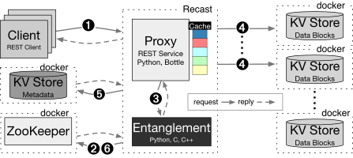

# RECAST

A python implementation of RECAST (to appear in the DSN18 proceedings).

Architecture
============

Design
------



Our implementation of the step-archive, named RECAST, is based on [playcloud](https://github.com/safecloud-project/playcloud).
As such its architecture is similar to playcloud's with the addition of a few components for metadata management and coordination.
The main components of the system are: a proxy/encoder, a metadata server, a coordination service and one or more storage nodes.

The proxy mediates interactions between clients and the system communicating over HTTP through a REST interface.
Users may insert new documents using a PUT request and retrieve them by issuing at GET request.

The encoder entangles the new documents with older ones already present in the system.
Note that depending on the use cases and resources available, the proxy can take care of the encoding without delegating to a dedicated encoder instance.

The metadata server keeps track of the stored document.
The information helps looking up blocks and checking their integrity as they are fetched from the storage nodes. In practice, the metadata is stored in a centralized key-value store.

The coordination service enables separate processes such as the proxy and the repair daemon to operate simultaneously in the same live instance.

Finally, storage nodes serve as backends.
They are considered independent and leveraged by the proxy to balance the reading and writing load evenly (as the blocks are placed randomly).

Implementation
--------------

The actual implementation of RECAST is a combination of existing pieces of software and new code.
The following paragraph is a brief presentation of the software used.

The proxy listens through a REST API written in Python(2.7) exposed by uwsgi 2.0.15 application server.
The entanglement is implemented using PyEClib and liberasurecode and Intel ISA-L.
Communication between separate proxy and encoder instances is done using grpc.

The metadata server is a Redis server, an in-memory key-value store, whose writes are logged on disk.
The coordination service is Zookeeper.
Finally, storage nodes can either be redis or minio nodes.

Each component is packaged as a separate docker container and can be deployed either locally, using docker-compose or on multiple machines using docker swarm mode (see Deployment section).

Deployment
==========

This section details the deployment procedure for RECAST.
As RECAST mostly relies on docker for ease of build and deployment, please make sure that you have the following requirements installed on your machine.

Local deployment
----------------

A local deployment only requires docker and docker-compose.
This process follows 2 steps:

* Build the docker images
* Deploy locally

### Build the docker images

At the top of the project, make sure file docker-compose.yml is present and then run:
```bash
docker-compose build
```

This command will build all the images that are not pre-built in the dockerhub.
At the end of the process you should be ready to deploy recast.

### Deploy locally

Having made sure that the images were built properly, run:
```bash
docker-compose up --detach=true
```

You should now have a running instance of RECAST listening on port 3000.
You can interact with this instance by trying to upload or read files as described in the basic usage section.

To stop your instance, run:
```bash
docker-compose down
```

Distributed deployment
----------------------

RECAST can be deployed in a distributed mode where the components are spread over multiple machines.
To deploy to multiple machines, RECAST suses docker and docker-swarm.
A typical deployment follows 3 steps:

* Create a docker swarm
* Build, push and download the docker images
* Deploy on the swarm

### Create a docker swarm

First ensure that all the machines that are to be added to the cluster have the docker-engine installed. One of these machines is to be chosen as the leader of the swarm.
On that machine, run:
```bash
docker-swarm init
```

Take good note of the leader token given as output of the command as it is going to be used by the other machines to join the cluster.
On the other machines, run docker-swarm join with the token to create the swarm.
```bash
docker swarm join <leader-token-here>
```

By the end of the process, the swarm is assembled and ready to move on image building and deployment.

### Build, push and download the docker images

In order run in swarm mode, the docker images used by RECAST must be built and then pushed to a docker registry.
More specifically, the proxy image must be pushed for RECAST to work.
For this process, make sure that you have an account on the docker hub.

First, build the image:
```bash
docker build --file pyproxy/Dockerfile –-tag <your-docker-username>/proxy
```

Enter your docker credentials if you have not yet been authenticated.
```bash
docker login
```

Then push the image to the docker hub.
```bash
docker push <your-docker-username>/proxy
```

Finally, edit the *docker-compose-production.yml* to replace the username prefix in the proxy service.
```yaml
...
version: "3"
  services:
    proxy:
      ...
      image: <your-docker-username>/proxy
      ...
```

### Deploy on the swarm

After successfully building and pushing the docker image to the docker hub, it is time to get RECAST running. At the top of the project, run:
```bash
docker stack deploy --compose-file docker-compose-production.yml recast
```

While you will get control of your console prompt quickly after running the command above, the complete deployment of RECAST might take some
time.
Indeed, on the first deployment over the swarm the images required to the container must be pulled by the machines running the matching
service.

Configuration
=============

RECAST can be launched without changes to the original configuration but the default settings may not suit all use cases.
Further fine-tuning may be needed to match the desired configuration.
In particular, RECAST's settings can be tweaked along two axes:

1.  Entanglement parameters

2.  Storage parameters

The tweaked parameters ultimately determine the storage overhead (in terms of disk utilization) to expect when launching a RECAST instance:

$$storage\ overhead = \ \frac{p}{s}*replication\ factor$$

The system operator must therefore be careful that the chosen RECAST configuration matches the resources available.

Entanglement parameters
-----------------------

RECAST implements the (s,t,e,p)-archive scheme and lets the operator set the coding parameters.
The number of source blocks (s), of pointers (t) and of parities (p) can be tuned by editing the content of *configuration.json* (at the top of the project) in the entanglement section.
```json
{
  ...
  "entanglement": {
    "type": "step",
    "configuration": {
      "s": 1,
      "t": 10,
      "p": 3
    }
  }
  ...
}
```

The file *configuration.json* serves as the central configuration file.
To spread the changes to other configuration files, the operator needs to run the following command from the top of the project.
```bash
./scripts/configure.py
```

The configuration changes should now have spread to the other configuration files: *pyproxy/dispatcher.json* and *pyproxy/pycoder.cfg*.

Storage parameters
------------------

For local or distributed experimentation, the number and type of storage nodes (minio or redis) can be specified in *configuration.json*.
You can also change the replication factor, which will impact the storage overhead before replica management.
```json
{
  ...
  "storage": {
    "nodes": 42,
    "type": "redis",
    "replication_factor": 2
  }
  ...
}
```

The change can then be propagated to the other configuration files by running:

This will result in a matching change in files *docker-compose.yml*, *docker-compose-production.yml* and *pyproxy/dispatcher.json*.

Please note that *pyproxy/dispatcher.json* is the actual configuration file read by RECAST at startup time (*configuration.json* is ignored at runtime and its changes must be spread by running *./scripts/configure.py* beforehand).
In consequence, *pyproxy/dispatcher.json* can be manually configured to connect to other storage backends that may not be containerized, deployed locally or even part of the swarm.
The operator should take care of deleting the unnecessary containers from *docker-compose.yml* and *docker-compose-production.yml* before starting RECAST when their storage backends are not managed by docker.

Basic usage
===========

Users can interact with a RECAST instance through the REST interface using an HTTP client such as curl or any other software library of their choice.

Insert a document
-----------------

Clients can upload files to the archive using a simple command.
```bash
curl --request PUT http://proxy-ip:3000/name --upload-file path/to/file
```

In this case, the client uploads the document located at *path/to/file* under the key *name*.
On a successful request, RECAST replies to the request with the chosen document name. In case of the failure RECAST replies with the appropriate HTTP error code (400 on empty requests or 409 when trying to overwrite a document).

In the case where a document cannot be stored under a user-prefered name, the client can choose to upload without a filename and let RECAST pick one for them.
```bash
curl --request PUT http://proxy-ip:3000/ --upload-file path/to/file
```

RECAST will then pick a random UUIDv4 as the name and send it in the reply to the client.

Read a document
---------------

Once uploaded to RECAST, files can be read using the filename picked by the client or the user at upload time.
```bash
curl --request GET http://proxy-ip:3000/name --output path/to/file
```

With this command, a user can recover a copy of a document stored in RECAST under the key *name* in *path/to/file*.
```bash
curl --request GET http://proxy-ip:3000/name/__meta
```

If a user is only interested in reading metadata about a given document, they can issue a request on the document and get result as a JSON object detailing information about the document, its blocks and the pointers used for entanglement.

Repair a document
-----------------

In case of loss of one or several blocks, the repair can be operated by attaching to a proxy instance and running the following command:
```bash
docker exec --interactive --tty proxy ./repair.py <block ids>
```

When auditing the entire archive to check for corruption of blocks, run:
```bash
docker exec --interactive --tty proxy ./repair.py
```

Replica management
==================

The right selection of pointers for entanglement is paramount to long-term protection of documents in the archive.
The paper described how to achieve better selection results using a mixed approach by picking one part of the pointers over the entire archive and the other in a sliding window over the most recent documents that entered the archive (aka the tail).
In addition, we proposed a similar window-based approach to provide short-term protection to documents in the tail of the archive through replication.
To deal with the storage overhead of this replication (see Section 4), our implementation provides two strategies for replica management: reference-counting and window-based. The rest of this section describes these strategies and their practical uses.

Replica management by reference counting
----------------------------------------

A new document entering the archive is entangled and split into blocks.
These blocks are immediately replicated, and the copies are spread across the storage nodes for redundancy.
From there on, the blocks can be used as pointers for the entanglement of new documents.
Thus, the reference count, or the number of times a block has been selected as a pointer, is bound to increase over time.
As this reference count also informs us on the possibility of recursive reconstruction in case of failure, we can leverage it to decide how to deal with the explosion in storage overhead.

Using a threshold value *th*, defined by the system operator, the replica management script can crawl the metadata looking for blocks that have been pointed at *th* or more times and delete their copies to lower the storage overhead across the storage nodes.

This strategy guarantees recovery of all blocks in case of block loss but requires expert fine-tuning.
Indeed, poor settings can lead to an archive where the storage overhead is not mitigated as best as possible or worse where some documents cannot be recovered in case of failure.

To run the replica management script using a reference-counting base in a RECAST instance on Docker, run:
```bash
docker exec --interactive --tty proxy ./scrub.py --pointers <th>
```

Or as a daemon, running at fixed intervals:
```bash
docker run --interactive --tty proxy --entrypoint ./scrub.py --pointers <th> --interval <seconds>
```

Replica management by sliding window
------------------------------------

A new document entering the archive is entangled and split into blocks.
As a recent document, it is still part of the tail of the archive made of the *w* most recent documents in the archive. In a system that uses mixed pointer selection, and is thus biased towards documents in the tail, we can assume that as documents exit the window, they can have been used as pointers and copies of their blocks can be discarded (see paper).

The sliding window strategy offers a way to maintain a predictable storage overhead and even guarantees that the size occupied by replicas decreases over time relative to the size of the archive.
But it does so with little regard to the actual recoverability of blocks themselves.
Indeed, a document could exit the window without all his blocks being pointed at least once.

To run the replica management script using a sliding window base in a RECAST instance on Docker, run:
```bash
docker exec --interactive –-tty proxy ./scrub.py --window <w>
```

Or as a daemon, running at fixed intervals:

```bash
docker run --interactive --tty proxy --entrypoint ./scrub.py --window <w> --interval <seconds>
```
